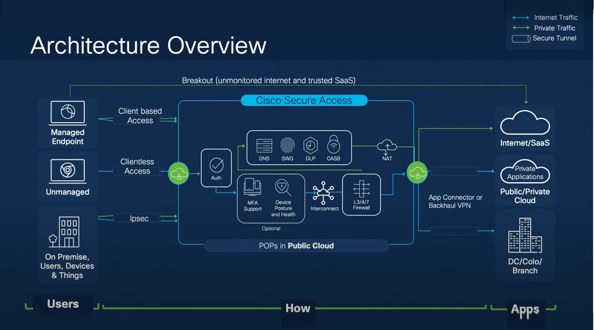

# secure-access-activity-report

[](https://developer.cisco.com/codeexchange/github/repo/vagner-instructor/fmc-remediation-module-ftd-shun)

# Cisco Secure Access Python Script for Activity Report in .CSV File

The Cisco Secure Access Python script for activity report in this repository requests an authorization token and them run a requests in the Reports API ENDPOINT for the time selected in the prompt. The following products are being used:

- Cisco Secure Access


This repository shows a simple example downloading the activity data in the Cisco Secure Access



This repository contains a small python code [example workflow](./code/cisco-secure-access-report.py). 

First - The python requests CLIENT ID and CLIENT SECRET
Second - It tests the credentials and replies if it's incorrect
Third - It requests YEAR MONTH DAY(s)
Forth - It runs downloading the data to a .CSV file

The time varies depending the customer's environment


## Installation

Clone the repo
```bash
git clone https://github.com/vagner-instructor/secure-access-activity-report.git
```

Go to your project folder
```bash
cd secure-access-activity-report
```

### Pre-requisites

Secure Access CLIENT ID and CLIENT SECRET
Period needed for the report

Python libs
import requests
import time
import csv
import calendar


## How to test the remediation module

Run the script
```bash
python3.13 cisco-secure-access-report.py
```

Reply the questions as prompted

## References

* [Cisco Secure Access API Documentation]([https://www.cisco.com/c/en/us/td/docs/security/firepower/tetration/quick-start/guide/fmc-rm-sw-qsg.html](https://developer.cisco.com/docs/cloud-security/secure-access-api-reference-reporting-overview/#secure-access-reporting-api-endpoints))


### DevNet Sandbox

https://devnetsandbox.cisco.com/DevNet/catalog/cisco-secure-access

## Caveats

Please note that the script provided in this repository is a sample module.
Although it provides a minimum viable module that provides the functionality as described above,
it is not ready for use in a production network.

Additional development would be required to meet necessary functional and non-functional
requirements for any customer environment before the module can be used in a production network.

## Getting help

If you have questions, concerns, bug reports, vulnerability, etc., please create an issue against this repository.

## Author(s)

This project was written and is maintained by the following individual(s):

* Vagner Silva

## OpenSSF Best Practices
[](https://www.bestpractices.dev/projects/9715)


## Credit(s)

* Victor Azevedo 


